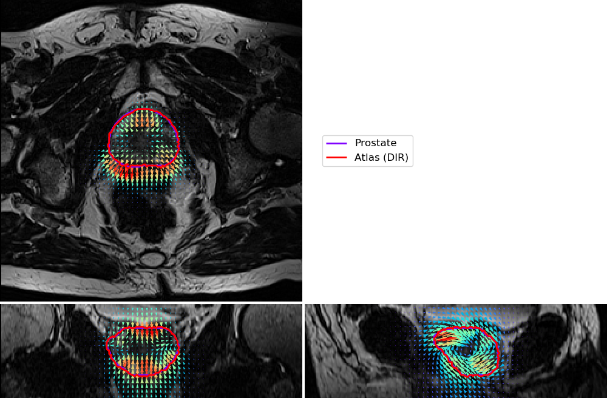
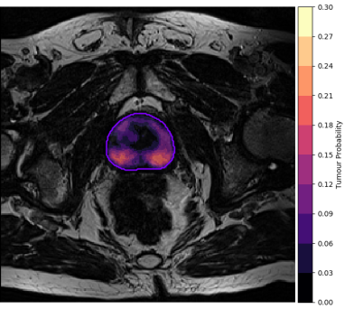
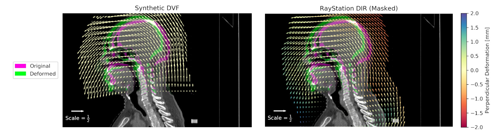

# PlatiPy 
### Processing Library and Analysis Toolkit for Medical Imaging in Python

PlatiPy is a library of **amazing** tools for image processing and analysis - designed specifically for medical imaging! 

PlatiPy was motivated by the need for a simple way to use, visualise, process, and analyse medical images.

PlatiPy is written in :snake: Python, and uses SimpleITK, VTK, and standard Python libraries. Jupyter notebooks are provided where
possible, mainly for guidance on getting started with using the tools.

You can find the [PlatiPy documentation here](https://pyplati.github.io/platipy/)

## What can I do with ***platipy***?
A lot! A good place to start is by looking in the [examples directory](https://github.com/pyplati/platipy/tree/master/examples).

Some examples of what PlatiPy can do:
 - DICOM organising and converting:
    * Bulk convert from multiple series and studies with a single function
    * Convert DICOM-RT structure and dose filesto NIfTI images
    * Create DICOM-RT structure files from binary masks e.g. from automatic contouring algorithms
 - Image registration
    * Register images and transform labels with a few lines of code
    * Linear transformations: rigid, affine, similarity
    * Non-linear deformable transformations: demons, b-splines
    * Multiple metrics for optimisation
 - Atlas-based segmentation
    * A suite of tools that can be used out-of-the-box
    * Includes advanced algorithms for [iterative atlas selection](https://doi.org/10.1088/1361-6560/ab652a/) and [vessel splining](https://doi.org/10.1088/1361-6560/abcb1d/)
 - Synthetic deformation field generation
    * Simulate anatomically realistic shifts, expansions, and bending
    * Compare DIR results from clinical systems
 - Basic tools for image processing and analysis
    * Computing label similarity metrics: DSC, mean distance to agreement, Hausdorff distance, and more
    * Cropping images to a region of interest
    * Rotate images and generate maximum/mean intensity projections (beams eye view modelling)

A major part of this package is **visualisation**, and some examples are shown below!

## Getting started
### Requirements
- Python 3.6 or greater
- See requirements.txt for required Python packages and requirements-dev.txt for librarites needed to contribute.
### Installation
- Python 3.6 or greater
- See requirements.txt for required Python packages and requirements-dev.txt for librarites needed to contribute.

Overlay a deformation vector field on an image (shown in orthogonal slices):

Overlay a scalar field on an image:

Create a comparison image, with vector fields:

## Authors

* **Phillip Chlap** - [phillip.chlap@unsw.edu.au](phillip.chlap@unsw.edu.au)
* **Robert Finnegan** - [robert.finnegan@sydney.edu.au](robert.finnegan@sydney.edu.au)
