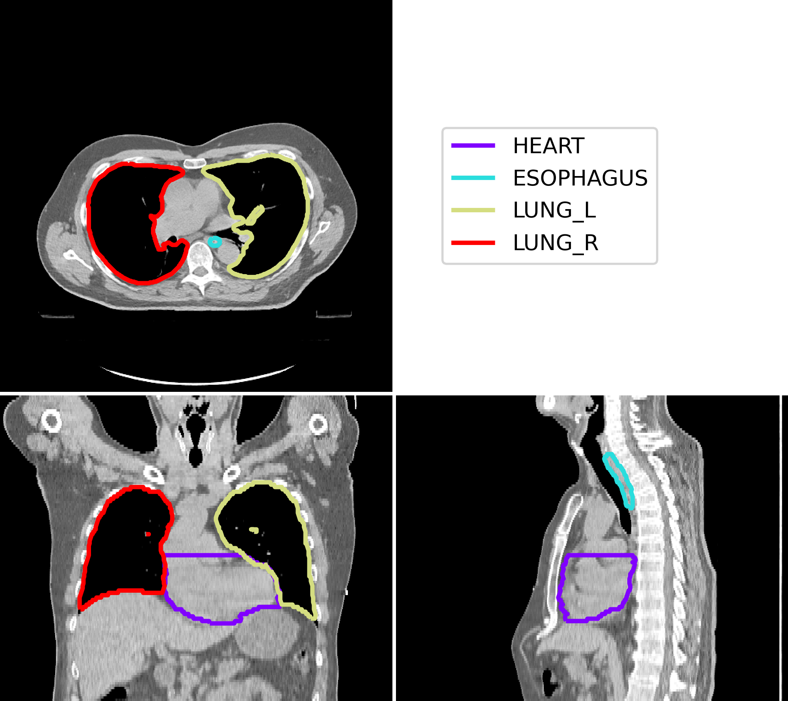
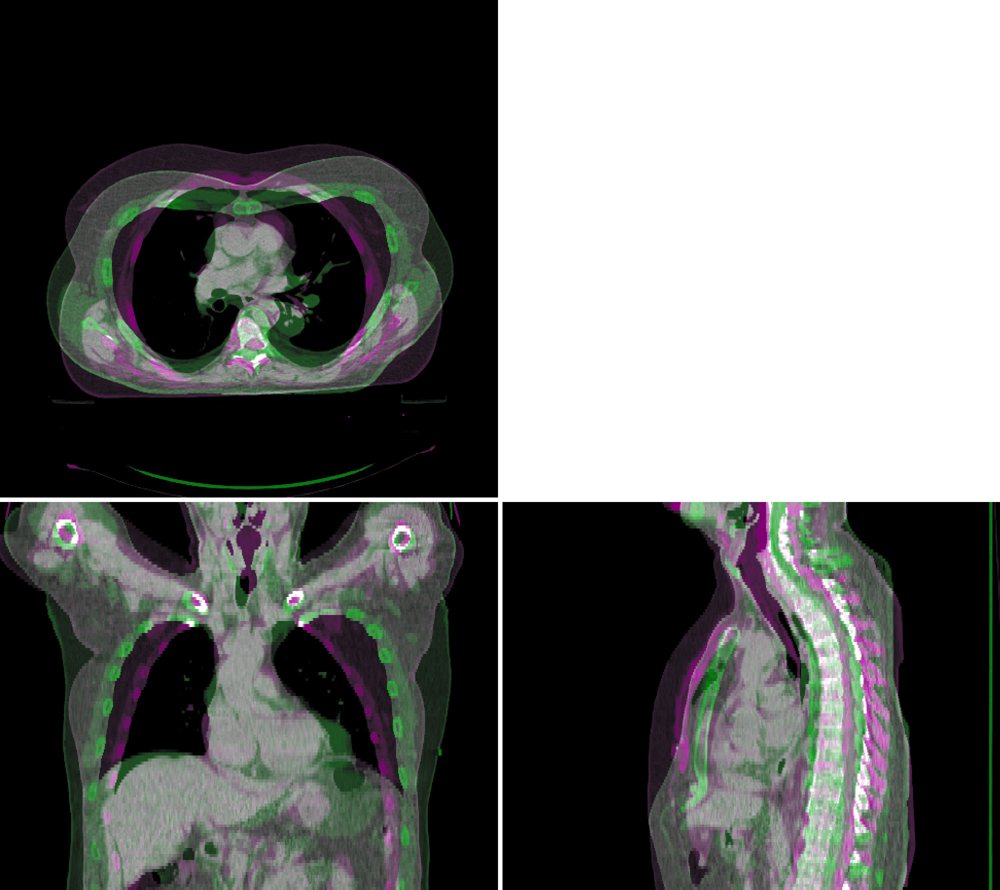
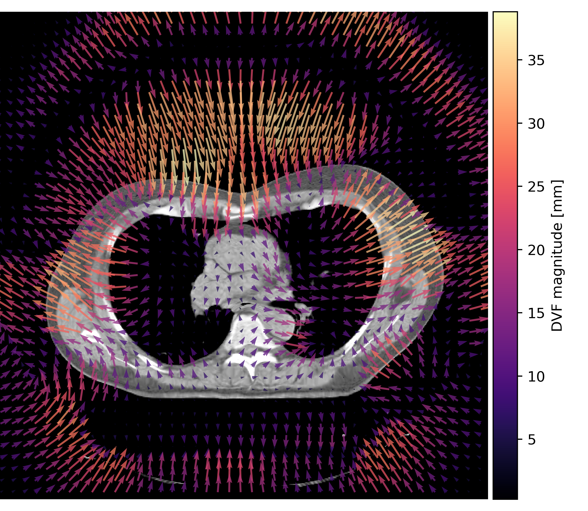

# PlatiPy 
## Processing Library and Analysis Toolkit for Medical Imaging in Python

PlatiPy is a library of **amazing** tools for image processing and analysis - designed specifically
for medical imaging! 

Check out the [PlatiPy documentation](https://pyplati.github.io/platipy/) for more info.

This project was motivated by the need for a simple way to use, visualise, process, and analyse 
medical images. Many of the tools and algorithms are designed in the context of radiation therapy,
although they are more widely applicable to other fields that use 2D, 3D, or 4D imaging.

PlatiPy is written in Python, and uses SimpleITK, VTK, and standard Python libraries. Jupyter
notebooks are provided where possible, mainly for guidance on getting started with using the tools.
We welcome feedback and contributions from the community (yes, you!) and you can find more
information about contributing [here](https://pyplati.github.io/platipy/contributing.html).

## What can I do with **platipy**?
A lot! A good place to start is by looking in the 
[examples directory](https://github.com/pyplati/platipy/tree/master/examples).

Some examples of what PlatiPy can do:
 - DICOM organising and converting:
    * Bulk convert from multiple series and studies with a single function
    * Convert DICOM-RT structure and dose filesto NIfTI images
    * Create DICOM-RT structure files from binary masks e.g. from automatic contouring algorithms
 - Image registration
    * Register images and transform labels with a few lines of code
    * Linear transformations: rigid, affine, similarity
    * Non-linear deformable transformations: demons, b-splines
    * Multiple metrics for optimisation
 - Atlas-based segmentation
    * A suite of tools that can be used out-of-the-box
    * Includes advanced algorithms for 
      [iterative atlas selection](https://doi.org/10.1088/1361-6560/ab652a/) and 
      [vessel splining](https://doi.org/10.1088/1361-6560/abcb1d/)
 - Synthetic deformation field generation
    * Simulate anatomically realistic shifts, expansions, and bending
    * Compare DIR results from clinical systems
 - Basic tools for image processing and analysis
    * Computing label similarity metrics: DSC, mean distance to agreement, Hausdorff distance, and more
    * Cropping images to a region of interest
    * Rotate images and generate maximum/mean intensity projections (beams eye view modelling)

A major part of this package is **visualisation**, and some examples are shown below!

#### Visualise some contours

``` python
from platipy.imaging import ImageVisualiser

vis = ImageVisualiser(image)
vis.add_contour(contours)
fig = vis.show()
```



#### Register some images

```python
from platipy.imaging.registration.linear import linear_registration

image_2_registered, tfm = linear_registration(
image_1,
image_2
)

vis = ImageVisualiser(image_1)
vis.add_comparison_overlay(image_2_registered)
fig = vis.show()
```



#### Calculate deformation vector fields
    
```python
from platipy.imaging.registration.deformable import fast_symmetric_forces_demons_registration

image_2_deformed, tfm_dir, dvf = fast_symmetric_forces_demons_registration(
image_1,
image_2_registered
)

vis = ImageVisualiser(image_2_deformed, axis="z")
vis.add_vector_overlay(
    dvf,
    subsample=12,
    arrow_scale=1,
    arrow_width=2,
    colormap=plt.cm.magma,
    name="DVF magnitude [mm]",
    color_function="magnitude"
)
fig = vis.show()
```



## Getting started
There aren't many requirements, just an installed Python interpreter (3.6 or greater). The list of
required Python packages can be found in requirements.txt.

PlatiPy can be installed with **pip**:

```bash
pip install platipy
```

## Authors

* **Phillip Chlap** - [phillip.chlap@unsw.edu.au](phillip.chlap@unsw.edu.au)
* **Robert Finnegan** - [robert.finnegan@sydney.edu.au](robert.finnegan@sydney.edu.au)
