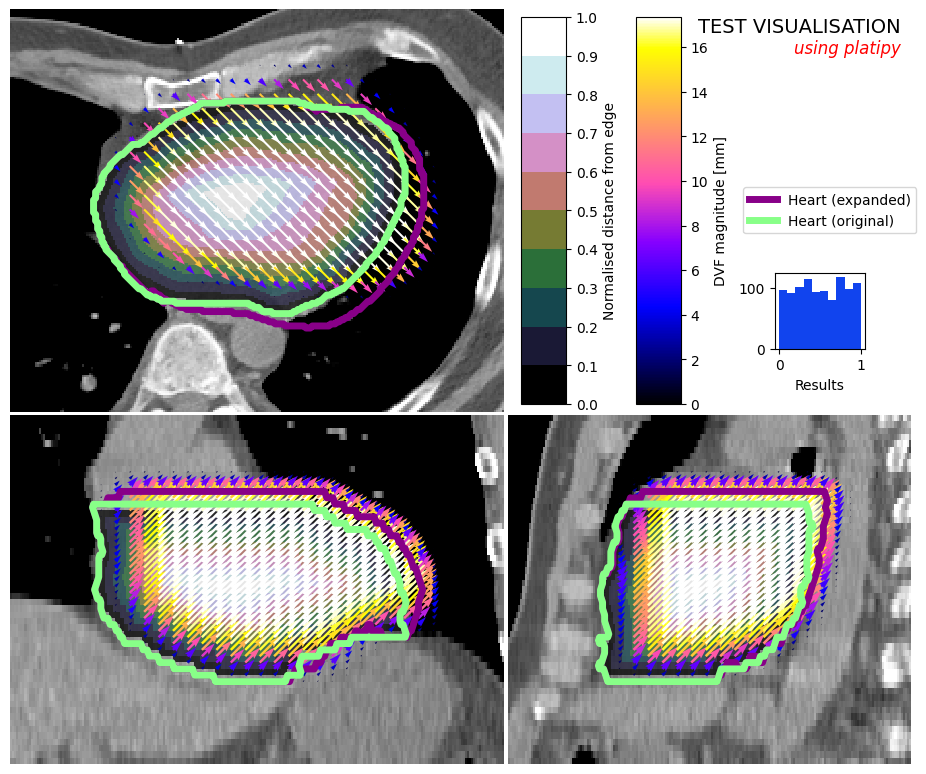

# Summary

PlatiPy offers a comprehensive suite of tools and utilities for conducting medical image analysis research utilising Python. These tools include functions for converting data between the clinical standard DICOM format and the research-friendly NIfTI format, capabilities for image registration and atlas-based segmentation, and efficient image visualisation tools to facilitate rapid development in research. Additionally, the library includes auto-segmentation models developed through various research projects enabling their streamlined deployment for use in future projects by the research community.

# Statement of need

Python has gained significant popularity in the field of medical image analysis research in recent years, due in part to its open-source nature and the support of a large community of third-party libraries. Libraries such as SimpleITK [@Lowekamp2013; @Yaniv2018], scikit-learn [@JMLR:v12:pedregosa11a] and pydicom [@Zenodo:mason] offer a wide range of functionality for developing medical image analysis tools. However, researchers often face the challenge of writing code to prepare data, creating wrapper functions for common procedures, and visualising images with scalar, vector or structure overlays throughout the analysis pipeline. PlatiPy addresses these challenges by providing many of these functions, eliminating the need for researchers to reinvent the wheel.

Other libraries and toolkits exist which provide complimentary functionality to PlatiPy. For example the Medical Imaging Interaction Toolkit (MITK) [@MITK_Team_MITK_2023] provides a C++ library and a graphical to perform a wide range of medical image analysis tasks including reading DICOM data, performing image registration and producing visualisations. The MIPAV (Medical Image Processing, Analysis, and Visualization) application [@MIPAV], OnkoDICOM [@OnkoDICOM] and dicompyler [@Panchal2010] also provide a graphical user interface for medical image analysis and analysis of radiotherapy data. While these tool have proven useful in many research projects, they do not provide Python bindings which is often desired in modern medical image analysis research software projects. Medical Open Network for AI (MONAI) is an open-source framework for deep learning in healthcare imaging [@Cardoso_MONAI_An_open-source_2022]. This is built on top of the pytorch ecosystem and would typically be used to develop an entire project. In comparison, PlatiPy provides many utility type functions which can be integrated as little or as much as needed for a research project. The Medical Image Processing in Python library (medpy) does provide many of these utility type functions however doesn't provide functionality in the way of image visualisation or image registration available in PlatiPy [@medpy].

Additionally, tools resulting from medical image analysis research projects are not always easily reusable outside of the original project context. Researchers may provide a GitHub repository with their tool, but it may lack documentation and require installation of various dependencies, making the process difficult and time-consuming. By incorporating these tools into PlatiPy and adhering to good software design principles, they can be more easily reused in future research projects.

### Image Visualiser

In medical image analysis, the ability to produce visualisations of images at various stages of the analysis pipeline, from initial inspection of the dataset to presentation of final results, is crucial for effective analysis. However, researchers often avoid visually inspecting their output due to the significant amount of boilerplate code required to produce these visualisations using the standard Python libraries such as matplotlib library directly. The Image Visualiser included in PlatiPy wraps this functionality within an easy-to-use class which can display the cross sections of 3D medical images as well as overlay contours, scalar volumes and deformation vector fields. Figures are produced using matplotlib allowing users to easily extend the visualisation functionality [@Hunter:2007]. An example of such a visualisation is provided in \autoref{fig:vis_example}.

This tool has proven useful across many projects and is capable of producing visualisations fit for publication, such as those in [@Finnegan2021; @Finnegan2022].

### DICOM Conversion

The DICOM standard is ubiquitous in the medical imaging field and is often the format in which research datasets are provided. While DICOM is useful in clinical scenarios, it can be challenging to work with and often researchers prefer other image formats, such as NIfTI, when developing code in context of a research project. The SimpleITK library can convert image volumes, such as CT and MRI, to NIfTI format, but conversion of other modalities specific to radiotherapy requires additional steps. To address this, PlatiPy provides functions for converting structure sets (RTSTRUCT) to separate NIfTI masks, as well as radiotherapy dose grids (RTDOSE) to a volume stored in NIfTI format.

Additionally, PlatiPy also provides functionality for converting data back to the DICOM format for analysis in clinical systems. This includes the ability to generate DICOM images, RTSTRUCT, and RTDOSE files from NIfTI.

### Image Registration

PlatiPy offers several functions that make it easy to perform linear (rigid) and non-linear (deformable) registration, as well as apply these transformations to images [\autoref{fig:reg_example}]. These registration tools are put to use in the atlas-based segmentation projects allowing users to easily start performing this kind of segmentation using their own data.

### Auto-segmentation

PlatiPy provides a variety of tools and functionality that have been utilised in several research projects aimed at developing auto-segmentation models. These include models based on thresholding, atlases, and deep learning. The library includes various tools for performing pre- and post-processing, image registration, and deep learning inference, making it a valuable resource for researchers working on auto-segmentation projects.

To date, two auto-segmentation models developed using PlatiPy have been deployed and made available through the library for direct use by researchers. The first is a cardiac sub-structure auto-segmentation model, which utilises a deep learning component to segment the whole heart, followed by an atlas-based segmentation and geometric definitions to segment 17 cardiac sub-structures on radiotherapy CT images [@Finnegan2023]. The second is a bronchial tree segmentation algorithm that employs threshold techniques to segment the lungs, followed by the airways in radiotherapy lung CT images [@Ghandourh2021].

### Metric computation

Computing similarity metrics between an auto-segmentation and a reference segmentation is a common task when working in the medical image analysis space. PlatiPy aims to provide a comprehensive collection of metrics to avoid the need for researchers to implement their own metrics or piece together functions from a range of other implementations. In addition, PlatiPy supplies functionality to compute several metrics at once and produce a visualisation of the results [\autoref{fig:contour_comp_example}] which enables rapid development of medical image analysis research tools.

# Acknowledgements

The authors of PlatiPy would like to thank the Medical Physics groups at the Ingham Institute and University of Sydney for their valuable contributions and for putting the library to use in their research. Their feedback and suggestions have played a crucial role in driving the development of PlatiPy. The authors also acknowledge the funding provided by the Australian Research Data Commons (ARDC) as part of the Australian Cancer Data Network (ACDN) Platform Program Grant, which has been instrumental in supporting the development of the library. The authors would also like to thank Simon Biggs and the team at PyMedPhys for their inspiration and influence on the development of PlatiPy [@Biggs2022].

Furthermore, the authors would like to acknowledge the use of data from The Cancer Imaging Archive in PlatiPy for examples, automated tests, and the figures in this paper [@Clark2013].

# References
